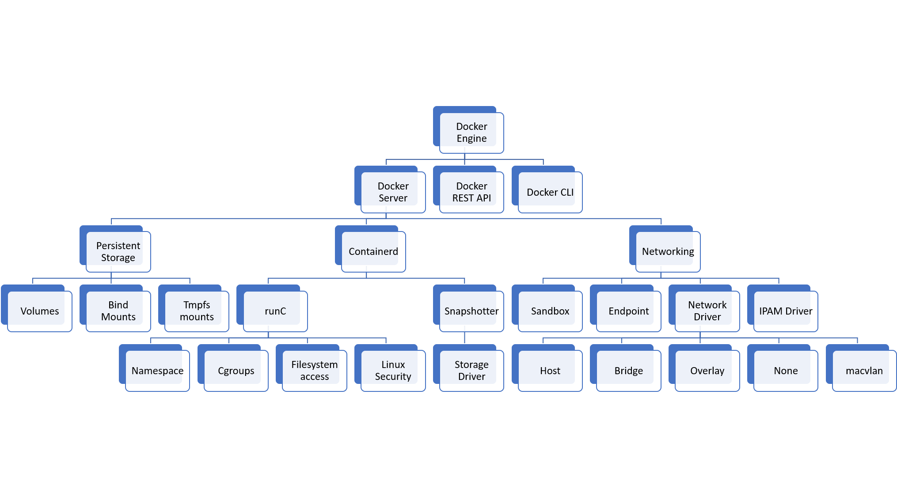

# Kaniko

## 컨테이너 런타임
- 저수준 컨테이너 런타임
  - namespace와 cgroup을 이용해서 컨테이너를 생성
  - runc, continaerd
- 고수준 컨테이너 런타임
  - 저수준 런타임 위에 배치되어 있는 이미지로부터 컨테이너를 실행
- 이미지 다운로드(고수준) -> 이미지를 번들로 압축 해제(고수준) -> 번들에서 컨테이너 실행(저수준)

## Docker

- docker client
- docker server
  
## Docker를 제공하지 않는 이유
- CRI가 등장 (여러 유형의 컨테이너 런타임을 허용하는 인터페이스) - kube 1.15
  - Kubernetes 초창기에는 Docker만 사용할 수 있었으나 다양한 Container Runtime이 등장하면서 표준화가 필요해짐
    - 
    - kubelet - docker shim - docker
      - kubelet이 docker와 직접 통신하지 못하며, docker shim을 통해 통신함
      - kubelet에서 docker shim을 지원하지 않게 됨
        - docker shim 유지보수에 대한 부담
        - docker 업데이트 부재
- Docker는 Client/Server, fork/exec 방식과 차이가 존재
  - Client/Server 방식의 경우 장애가 발생하면 자식에게 모두 영향을 줌
- Docker는 Root 권한을 가지고 있어야 해서 보안적인 이슈 지님

## 다른 빌드 도구 등장
- Kubernetes가 Docker를 제공하지 않으면서 클러스터 내부에서 이미지 빌드가 어려워짐
- Docker가 아닌 다른 빌드 도구 등장
  - kaniko, buildah 등

---

### Docker를 통해서 로컬에서 컨테이너 이미지 빌드
```
$ docker build -t devops-toolkit .
``` 

### 컨테이너에서 Docker로 컨테이너 이미지 빌드
```
$ kubectl apply -f docker.yaml
$ kubectl exec -it docker -- sh
$ apk add -U git
$ git clone https://github.com/onenumbersol/kaniko-demo
$ docker build -t devops-toolkit .

/kaniko-demo # docker build -t devops-toolkit .
Cannot connect to the Docker daemon at unix:///var/run/docker.sock. Is the docker daemon running

```

### Docker 소켓을 통해 컨테이너 이미지 빌드
```
$ kubectl apply -f docker-socket.yaml
$ kubectl exec -it docker -- sh
$ apk add -U git
$ git clone https://github.com/onenumbersol/kaniko-demo
$ docker build -t devops-toolkit .

Sending build context to Docker daemon  17.46MB
Step 1/9 : FROM klakegg/hugo:0.78.2-alpine AS build

```

### Kubernetes 클러스터에서 Kaniko로 컨테이너 이미지 빌드
- Kubernetes 클러스터 혹은 컨테이너 내에서 Dockerfile을 사용하여 컨테이너 이미지를 빌드
- Docker-In-Docker 빌드의 문제점을 해결
  - DIND보다 빠르고, 권한을 요구하거나 소켓을 노출하지 않으므로 보안적으로 훌륭함
```
$ cat kaniko-git.yaml
    - edit context, destination
$ kubectl create secret docker-registry regcred --docker-server=<your-registry-server> --docker-username=<your-name> --docker-password=<your-pword> --docker-email=<your-email>
$ kubectl apply -f kaniko-git.yaml

$ kubectl logs -f kaniko
Enumerating objects: 203, done.
Counting objects: 100% (25/25), done.
Compressing objects: 100% (17/17), done.
Total 203 (delta 16), reused 12 (delta 8), pack-reused 178
INFO[0001] Resolved base name klakegg/hugo:0.78.2-alpine to build 
INFO[0001] Using dockerignore file: /kaniko/buildcontext/.dockerignore 
INFO[0001] Retrieving image manifest klakegg/hugo:0.78.2-alpine 
INFO[0001] Retrieving image klakegg/hugo:0.78.2-alpine from registry index.docker.io 
INFO[0004] Retrieving image manifest nginx:1.19.4-alpine 
INFO[0004] Retrieving image nginx:1.19.4-alpine from registry index.docker.io
```

## 참고 사이트
- https://kubernetes.io/ko/blog/2020/12/02/dont-panic-kubernetes-and-docker/
- https://github.com/GoogleContainerTools/kaniko
- https://github.com/vfarcic/kaniko-demo
- https://www.youtube.com/watch?v=EgwVQN6GNJg&feature=youtu.be
